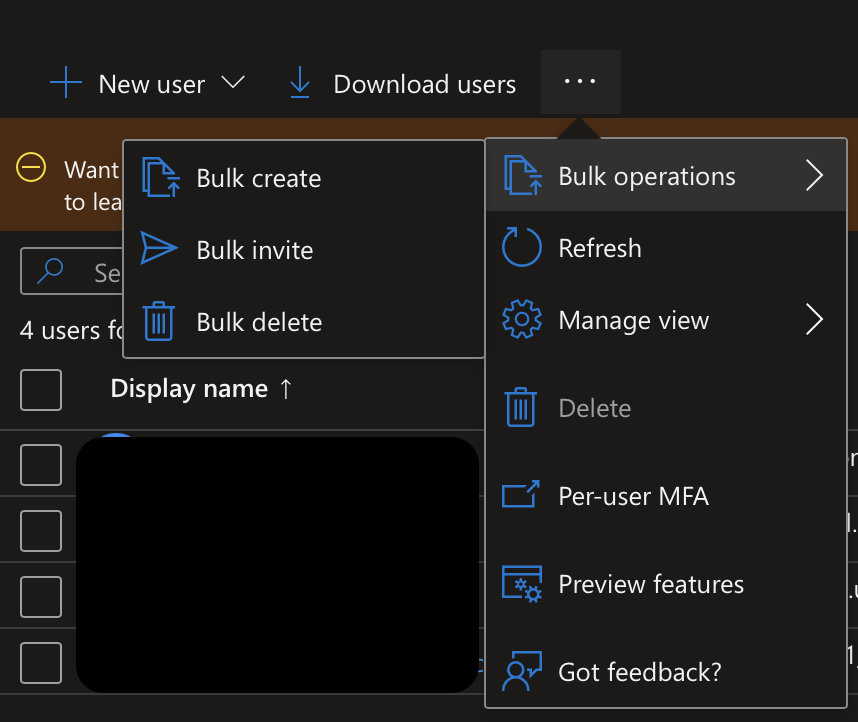
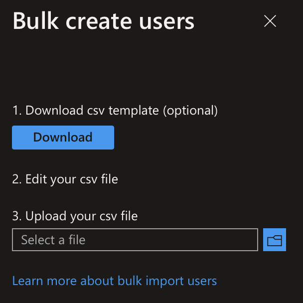
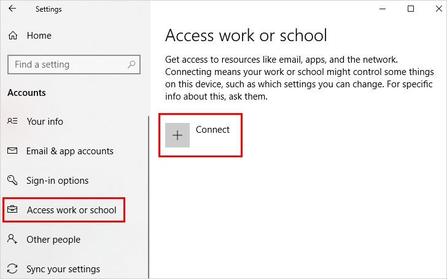
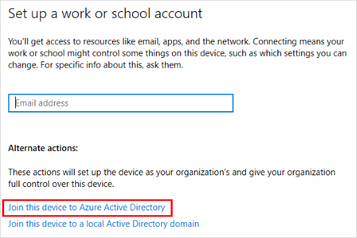

# Identity & Governance

## Table of Contents

- [Identity & Governance](#identity--governance)
  - [Table of Contents](#table-of-contents)
  - [Bulk import of users into AAD](#bulk-import-of-users-into-aad)
  - [Azure AD Joined Devices](#azure-ad-joined-devices)
    - [Joining a device](#joining-a-device)
  - [Azure Registered Devices](#azure-registered-devices)
    - [Registering a device](#registering-a-device)
  - [Azure Self-Service Password Reset (SSPR)](#azure-self-service-password-reset-sspr)

Azure admins implement, manage, monitor and organise the azure environment.

Cloud Identity - A Local azure user or external azure AD user

Hybrid Identity - A directory synced user

Guest Identity - External users invited to the domain

## Bulk import of users into AAD

To bulk import go to the Azure AD portal > Users and go to the 3 dots menu and choose bulk operations shown in the image below.

Once you select the bulk add operation you can download the CSV file provided by microsoft and edit as needed.

The required values have 'Required' in the header of the table.

## Azure AD Joined Devices

This is a device that has been joined to Azure AD using an organizational account. This will require the user to use their AD username and password when logging into their device.

This is suitable for both cloud and hybrid environments.

This method is supported by All versions of Windows 10 and 11 except Home edition.

### Joining a device

You can join a device that has already been setup or used by going into the settings and selecting 'accounts' then 'Access work or school', this will bring up the screen below.

Once you have clicked 'Connect' you will need to click 'Join this device to Azure Active Directory' shown in the screenshot below.

Now you will be asked for your account details and to check that you are joining the correct domain.

Once you click 'Join' your device will be added to the Azure Active Directory and is can be fully managed by that domain.

## Azure Registered Devices

This is used to support users for BYOD (Bring Your Own Device) or a mobile device. In this situation it is recommended to use this when the user wants to use their personal device and wants to retain ownership.

This is a device that is registered with Azure AD but does not require an organizational account to login.

### Registering a device

You can register a device that has already been setup or used by going into the settings and selecting 'accounts' then 'Access work or school', this will bring up the screen below.

Once you have clicked 'Connect' enter your email address and password to the domain you are trying to join and sign-in, once this is complete the device will be registered.

## Azure Self-Service Password Reset (SSPR)

