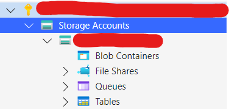
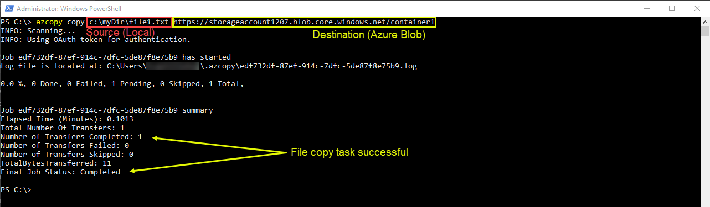
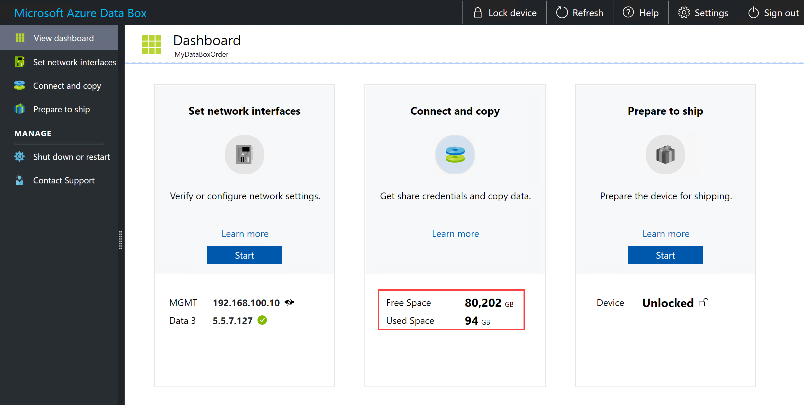
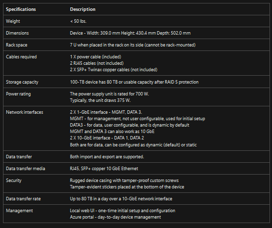
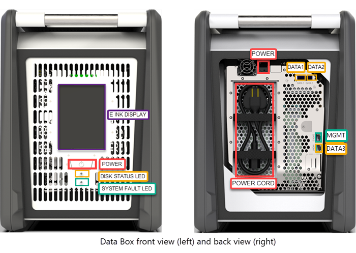

# Storage

## Table of Contents

- [Storage](#storage)
  - [Table of Contents](#table-of-contents)
  - [Storage Accounts](#storage-accounts)
  - [Interaction tools](#interaction-tools)
    - [Storage explorer](#storage-explorer)
    - [AzCopy](#azcopy)
    - [Databox](#databox)
      - [Benefits](#benefits)
      - [Specifications](#specifications)
      - [Databox Components](#databox-components)
    - [Datafactory](#datafactory)
  - [Performance tiers](#performance-tiers)
  - [Storage account resiliency](#storage-account-resiliency)
  - [Storage Access Control](#storage-access-control)
    - [Shared Account Keys](#shared-account-keys)
      - [Protect your access keys](#protect-your-access-keys)
      - [Viewing Access Keys](#viewing-access-keys)
    - [Shared Access Signatures (SAS)](#shared-access-signatures-sas)
      - [Types of shared access signatures](#types-of-shared-access-signatures)
        - [User delegation SAS](#user-delegation-sas)
        - [Service SAS](#service-sas)
        - [Account SAS](#account-sas)
      - [Forms of SAS](#forms-of-sas)
      - [How SAS works](#how-sas-works)
      - [When to use SAS](#when-to-use-sas)
      - [Best practices with SAS](#best-practices-with-sas)
    - [Azure Active Directory Integration](#azure-active-directory-integration)

## Storage Accounts

Storage accounts contain all of your azure storage data objects, including blobs, file shares, queues, tables and disks, on creation they must have a unique name (This is unique to the whole of azure not just your subscription) and allows access from anywhere in the world over HTTP or HTTPS.

## Interaction tools

There are many ways to interact with data that is stored on azure, the easiest being through the azure portal.

### Storage explorer

The storage explorer application is provided by microsoft, using this you can connect to different storage accounts and resource allocated to the account you have signed in to.

You can also use this tool to upload data to a storage resource. 

### AzCopy

AZCopy is a command-line utility that you can use to copy blobs or files to and from a storage account.  To use AZCopy you must authorise using either Azure Active Directory or a SAS Token. AZCopy can be used to create containers, upload and download data. 

### Databox

Databox is the azure solution that lets you send terabytes of data into and out of azure in a quick, inexpensive and reliable way. The secure data transfer is accelerated by shipping a proprietary storage device to the user to put their data on and send back, currently the maximum usable storage capacity is 80TB. The device has rugged casing to protect and secure data during the transit.

You can order the data box via the azure portal. Once the device is received, you can quickly set it up using the local web UI.

Import use cases:
  
- Onetime Migration:
    When a large amount of on-prem data needs to be moved to azure.

- Initial bulk transfer (Seedbox):
    An initial bulk transfer is done using Data box (seed) follow by incremental transfers over the network.

Export use cases:

- Disaster recovery of a large amount of data:
    When a copy of the data from azure is needed to be restored to an on-prem environment.

- Migration back to on prem:
    When you want to move all the data back to on-prem or another cloud service provider.

#### Benefits

**Speed** - Databox uses 1-Gbps or 10Gbps network interfaces to move data in and out of azure

**Secure** - Databox has built in security protects:
    - The device has a rugged casing secured by tamper resistant screws and tamper evident stickers.
    - The data on the device is encrpyted with AES-256 encryption at all times.
    - The device can only be unlocked with a password provided in the Azure portal
    - Once the data from an import order is uploaded to azure,, the disks on the device are wiped clean in accordance with NIST 800-88r1 standards.

#### Specifications

#### Databox Components

### Datafactory

## Performance tiers

Standard
Premium
Hot/Cool/Archive

## Storage account resiliency

LRS
GRS
GZRS

## Storage Access Control

Each time you access data in a storage account, your client application makes a request over HTTPS/HTTP. By default, every resource in Azure Storage is secured and every request to a secure resource must be authorised.

The following table shows the options that azure storage offers for authorising access to data.

### Shared Account Keys

When you create a storage account, Azure generates two 512-bit storage account access keys for the account. These keys can be used to authorise access to data in your storage account via shared key authorisation.

Microsoft recommends that you use Azure key vault to manage access keys and that you regularly rotate and regenerate keys. Using azure key vault makes it easy to rotate keys without interruption to applications.

#### Protect your access keys

Storage account access keys are similar to a root password for your storage account.

#### Viewing Access Keys

Access keys can be found under the 'Security + Networking' Section of the storage account. 

Inside of the 'Access Keys' option you can also set a reminder so that you never forget to rotate or regenerate keys. If you wanted to manually rotate or regenerate keys this is also where you could do it.

### Shared Access Signatures (SAS)

A shared access signature provides secure delegated access to resources in a storage account. With a SAS, you have control over how a client can access your data.
For example:
    - What resources the client may access
    - What permissions they have with those resources.
    - How long the SAS is valid

#### Types of shared access signatures

This is used to allow control over what can be done by the client.

When generating the SAS a URI will be generated that can be used with Azure storage explorer.

Azure storage supports three types of shared access signatures:
    - User delegation SAS
    - Service SAS
    - Account SAS

##### User delegation SAS

A user delegation SAS is secured with Azure active directory credentials and also by the permissions specified for the SAS. User delegation SAS applies to Blob Storage only.

##### Service SAS

A service SAS is secured with the Storage account key. A service SAS delegates access to a resource in only one of the Azure storage Services: Blob, Queue, Table or Azure Files.

##### Account SAS

An account SAS is secured with the storage account key. An account SAS delegates access to resources in one or more of the storage services. All operations available via a service or user delegation SAS are also available via an account SAS.

#### Forms of SAS

- Ad hoc SAS:
  - When you create an ad hoc SAS, the start time, expiry time and permissions are specified in the SAS URI. Any type of SAS can be an ad hoc SAS.

- Service SAS with storage access policy:
  - A stored access policy is defined on a resource container, which can be a blob container, tbale queue or file share. The stored access policy can be used to manage constraints for one or more service shared access signatures. When you associate a service SAS with a stored access policy, the SAS inherits the constraints i.e the start time, expiry time and permissions that were defined in the stored access policy.

#### How SAS works

A shared access signature is a signed URI that points to one or more storage resources. The URI includes a token that contains a special set of query parameters. The token indicates how the resources may be accessed by the client. The signature is constructed from the SAS parameters and signed with the key that was used to create the SAS. This signature is used by Azure storage to authorise access to the storage resource.

#### When to use SAS

A SAS should be used to give secure access to resources in a storage account to any client who does not otherwise have permissions to that resource.

#### Best practices with SAS

When you use SAS in your applications, you need to be aware of these two potential risks:
    - If a SAS is leaked, it cna be used by anyone who obtains it.
    - If a SAS provided to a client application expires and the application is unable to retrieve a new SAS from the service, the applications functionality may be hindered.

Recommendations:
    - Always use HTTPS to create and/or distribute a SAS
    - Use a user delegation SAS when possible (AD Auth SAS)
    - Have a revocation plan in place
    - Configure a SAS Expiration policy
    - Create a stored access policy for a service SAS

### Azure Active Directory Integration

You can use AAD for authorising requests to blob, queue and table resources. Microsoft recommends using Azure AD credentials to authorize requests to data when possible for optimal security and ease of use.